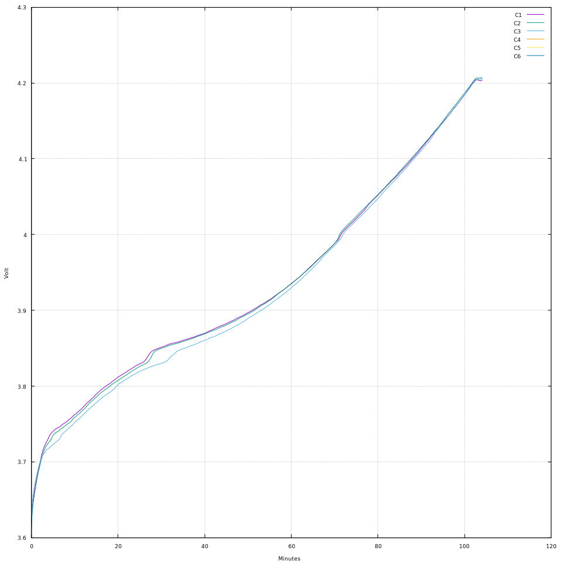

Logging tool for SkyRC iMAX B6 Mini (and possibly similar) chargers
-------------------------------------------------------------------

This tool can monitor and log data from chinese 4-button battery chargers that
come with a USB port.

Right now, only SkyRC’s iMAX B6 Mini charger is supported, but it’s very
possible that many other, similar chargers use the same HID-based protocol.

Compilation
===========

This needs libudev.

``cc $(pkg-config --cflags --libs libudev) -lm b6mon.c -o b6mon``

Usage
=====

This tool needs write access to the USB device, so either run as root or set
up access through udev rules.

b6mon -[p|s]

+--------+---------------------------------------------------------+
| Option | Effect                                                  |
+========+=========================================================+
| -p     | Monitor process status until end of process.            |
+--------+---------------------------------------------------------+
| -s     | continuously monitor system status (cell voltage only)  |
+--------+---------------------------------------------------------+

To do (aka patches welcome)
===========================

* Reverse engineer the rest of the protocol (config, maybe fw update)
* Support more chargers (e.g. those that can charge 8 cell batteries)

Tips
====

Live plotting with gnuplot
--------------------------

Start logging::

    b6mon -p > process.log

Run gnuplot (sample file included)::

    gnuplot process.plt

Example:

License
=======

This software is available under the terms of the ISC license.
